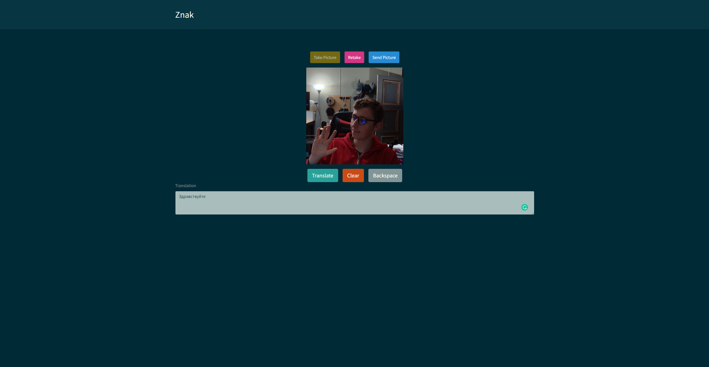

# Znak

## Description:

This is a simple front end intended to interact with an ai developed by John Simmons, which excepts a base64 image via HTTP request and returns which letter of the alphabet it thinks is being represented in American Sign Language. The user will take a picture of their sign using their webcam, then can choose to retake the picture or send it to the ai for translation. When the user completes a word, they can then translate that word from english to cyrillic using the Yandex translation api. this is a custom ai with the front end built using React and React Bootstrap. It is set up in a modular way to allow for multiple methods of deployment, and additional pages in the future.

# Table of Contents

- [Repository](#repository)
- [Examples](#examples)
- [Technologies Used](#technologies-used)
- [Questions](#questions)
- [Contributions](#contributing)
- [License](#license)

## Repository:

---

- [My Github Profile](https://github.com/Grey-Whitt)

- [This Repository](https://github.com/Grey-Whitt/znak)

## Examples

---

Here is an example of what the UI looks like.

## Technologies Used

---

Express.js  
React  
Node.js  
React Router v6  
React Bootstrap v5

## Questions

---

If you have any questions feel free to email me or find me on LinkedIn

[greywhitt@gmail.com](mailto:greywhitt@gmail.com)

[My LinkedIn](https://www.linkedin.com/in/grey-whittenberger)

## Contributing:

---

Contributions, issues and feature requests are welcome.

## License:

---

Copyright 2022 Grey Whittenberger

Permission is hereby granted, free of charge, to any person obtaining a copy of this software and associated documentation files (the "Software"), to deal in the Software without restriction, including without limitation the rights to use, copy, modify, merge, publish, distribute, sublicense, and/or sell copies of the Software, and to permit persons to whom the Software is furnished to do so, subject to the following conditions:

The above copyright notice and this permission notice shall be included in all copies or substantial portions of the Software.

THE SOFTWARE IS PROVIDED "AS IS", WITHOUT WARRANTY OF ANY KIND, EXPRESS OR IMPLIED, INCLUDING BUT NOT LIMITED TO THE WARRANTIES OF MERCHANTABILITY, FITNESS FOR A PARTICULAR PURPOSE AND NONINFRINGEMENT. IN NO EVENT SHALL THE AUTHORS OR COPYRIGHT HOLDERS BE LIABLE FOR ANY CLAIM, DAMAGES OR OTHER LIABILITY, WHETHER IN AN ACTION OF CONTRACT, TORT OR OTHERWISE, ARISING FROM, OUT OF OR IN CONNECTION WITH THE SOFTWARE OR THE USE OR OTHER DEALINGS IN THE SOFTWARE.

For more information about licenses, please visit:
[License](https://opensource.org/licenses/MIT)
